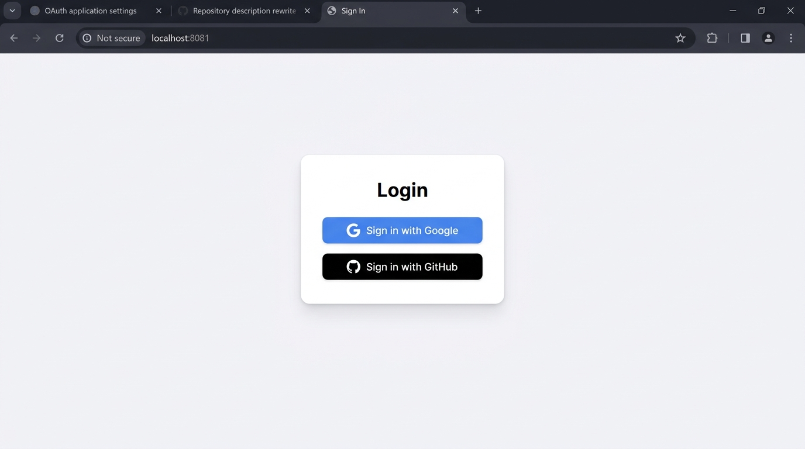

# SignIn-Demo

A Spring Boot application demonstrating OAuth 2.0 login with Google and GitHub.



## 🔄 How It Works

When you click Google or GitHub:

```
Your Browser
     |
     | Click "Google"
     ↓
Spring Boot Application
     |
     | Redirect to Google
     ↓
Google Login
     |
     | User gives permission
     ↓
Google redirects back
     ↓
Spring Security
     ↓
Application Home Page
```

The same process happens with GitHub.

---

## 🛠️ Technologies Used

- Java 17
- Spring Boot
- Spring Security
- OAuth 2.0
- Google OAuth 2.0
- GitHub OAuth 2.0
- Thymeleaf
- Maven
- Docker

---

## 📁 Project Structure

```
SignIn-Demo/
│
├── .mvn/
│   └── wrapper/
│
├── src/
│   ├── main/
│   │   ├── java/
│   │   │   └── ...
│   │   │
│   │   └── resources/
│   │       ├── templates/
│   │       │   ├── index.html
│   │       │   └── dashboard.html
│   │       │
│   │       └── application.properties
│   │
│   └── test/
│
├── .dockerignore
├── .gitignore
├── Dockerfile
├── mvnw
├── mvnw.cmd
├── pom.xml
└── README.md
```

---

## ⚙️ Prerequisites

Before running this project, install:

### 1. Git

Download Git:  
[https://git-scm.com/downloads](https://git-scm.com/downloads)

Check installation:

```
git --version
```

### 2. Docker Desktop

Install Docker Desktop:  
[https://www.docker.com/products/docker-desktop/](https://www.docker.com/products/docker-desktop/)

After installing Docker Desktop, make sure Docker is running.

Check:

```
docker --version
```

You should get something similar to:

```
Docker version 28.x.x
```

> You do **NOT** need to install Maven separately if you are running the application using Docker.  
> You also do **NOT** need to install Java separately for the Docker method.  
> The Docker image contains the required Java runtime and downloads the Maven dependencies while building the image.

---

## 📥 Step 1 — Clone the Repository

Open a terminal.

Run:

```
git clone https://github.com/Chandu2411/SignIn-Demo.git
```

Go inside the project:

```
cd SignIn-Demo
```

You should see files such as:

```
Dockerfile  pom.xml  src  mvnw  mvnw.cmd
```

---

## 🔑 Step 2 — Create Google OAuth Credentials

The application needs Google OAuth credentials so that users can log in with Google.

Go to:  
[https://console.cloud.google.com/](https://console.cloud.google.com/)

### Create a Google Cloud Project

1. Open Google Cloud Console.
2. Create a new project.
3. Select the project.
4. Open the **Google Auth Platform / OAuth configuration**.
5. Configure the OAuth consent screen.
6. Create an OAuth Client ID.

Choose:
- **Application type:** Web application

### Authorized Redirect URI

For local Docker execution, the application will run at:

```
http://localhost:8081
```

Add this redirect URI:

```
http://localhost:8081/login/oauth2/code/google
```

> ⚠️ Make sure the port is **8081**.  
> Do **NOT** use:
> ```
> http://localhost:8080/login/oauth2/code/google
> ```
> because Docker exposes the application to your computer through port **8081**.

### Copy the Google Credentials

You will receive:
- Client ID
- Client Secret

Keep them private.

---

## 🐙 Step 3 — Create GitHub OAuth Credentials

Go to:  
[https://github.com/settings/developers](https://github.com/settings/developers)

Then:

```
Developer settings
     ↓
OAuth Apps
     ↓
New OAuth App
```

Fill in the application information.

For the **homepage URL**:

```
http://localhost:8081
```

For the **Authorization callback URL**:

```
http://localhost:8081/login/oauth2/code/github
```

Create the OAuth application.

GitHub will provide:
- Client ID
- Client Secret

Keep the secret private.

---

## 🔐 Step 4 — Create the `.env` File

> ⚠️ This is **VERY IMPORTANT**.

The application needs four secret values:

```
GOOGLE_CLIENT_ID
GOOGLE_CLIENT_SECRET
GITHUB_CLIENT_ID
GITHUB_CLIENT_SECRET
```

Create a file named:

```
.env
```

in the **ROOT** of the project.

Your project should look like:

```
SignIn-Demo/
│
├── .env
├── Dockerfile
├── pom.xml
├── src/
└── ...
```

---

## ✏️ Step 5 — Add Your Credentials to `.env`

Open `.env`.

Add:

```
GOOGLE_CLIENT_ID=YOUR_GOOGLE_CLIENT_ID
GOOGLE_CLIENT_SECRET=YOUR_GOOGLE_CLIENT_SECRET
GITHUB_CLIENT_ID=YOUR_GITHUB_CLIENT_ID
GITHUB_CLIENT_SECRET=YOUR_GITHUB_CLIENT_SECRET
```

Replace the placeholder values with your actual credentials.

For example:

```
GOOGLE_CLIENT_ID=123456789-example.apps.googleusercontent.com
GOOGLE_CLIENT_SECRET=GOCSPX-example
GITHUB_CLIENT_ID=Iv1.example
GITHUB_CLIENT_SECRET=example_secret
```

> ❌ Do **NOT** copy these example values.  
> Use your **own** credentials.

---

## 🚨 IMPORTANT SECURITY WARNING

**NEVER upload your `.env` file to GitHub.**

Your `.env` contains private OAuth credentials.

The `.gitignore` file should contain:

```
.env
target/
*.jar
```

Check that Git is ignoring `.env`:

```
git check-ignore .env
```

If you see:

```
.env
```

then Git is ignoring it correctly.

---

## 🐳 Step 6 — Build the Docker Image

Make sure you are inside the project directory:

```
cd SignIn-Demo
```

Build the Docker image:

```
docker build -t signin-demo:latest .
```

Docker will:

```
Dockerfile
     ↓
Install/use Java environment
     ↓
Copy Maven project
     ↓
Download Maven dependencies
     ↓
Build Spring Boot application
     ↓
Create app.jar
     ↓
Create Docker image
```

> The first build can take some time because Maven needs to download the dependencies.  
> You do **NOT** need to manually download the Spring Boot dependencies.  
> Maven handles that automatically.

---

## 🔍 Step 7 — Check the Docker Image

Run:

```
docker images
```

You should see:

```
signin-demo
```

For example:

```
REPOSITORY       TAG       IMAGE ID        SIZE
signin-demo      latest    xxxxxxxxxxxx    ...
```

---

## ▶️ Step 8 — Run the Docker Container

Run:

**Windows CMD**

```cmd
docker run -d ^
  --name signin-demo-container ^
  -p 8081:8080 ^
  --env-file .env ^
  signin-demo:latest
```

The command above works in **Windows CMD**.

If you are using **PowerShell**, use:

```powershell
docker run -d `
  --name signin-demo-container `
  -p 8081:8080 `
  --env-file .env `
  signin-demo:latest
```

If you are using **Linux/macOS/WSL**:

```bash
docker run -d \
  --name signin-demo-container \
  -p 8081:8080 \
  --env-file .env \
  signin-demo:latest
```

### 🧠 Understanding `-p 8081:8080`

This can be confusing for beginners.

The command:

```
-p 8081:8080
```

means:

```
Your Computer          Docker Container
localhost:8081  ──────────→  port 8080
                                 |
                                 ↓
                           Spring Boot
```

Spring Boot runs on port **8080** inside the container.  
Your Windows computer accesses it through **8081**.

Therefore open:

```
http://localhost:8081
```

---

## 🔍 Step 9 — Check Whether the Container Is Running

Run:

```
docker ps
```

You should see something similar to:

```
CONTAINER ID   IMAGE                  PORTS
xxxxxxxx       signin-demo:latest     0.0.0.0:8081->8080/tcp
```

If you see the container, it is running.

---

## 🌐 Step 10 — Open the Application

Open your browser:

```
http://localhost:8081
```

You should see:

```
Login with OAuth 2.0
  GitHub
  Google
```

Now click **Google** or **GitHub** and complete the login.

---

## 📜 Step 11 — Check Application Logs

If something doesn't work, first check the logs.

Run:

```
docker logs signin-demo-container
```

You should see something similar to:

```
:: Spring Boot ::
Tomcat initialized with port 8080
Tomcat started on port 8080
Started SigninApplication
```

This means the Spring Boot application started successfully.

---

## 🔄 Useful Docker Commands

| Action | Command |
|---|---|
| Check running containers | `docker ps` |
| Check all containers | `docker ps -a` |
| Stop the application | `docker stop signin-demo-container` |
| Start the application again | `docker start signin-demo-container` |
| Restart the application | `docker restart signin-demo-container` |
| View logs | `docker logs signin-demo-container` |
| Follow logs continuously | `docker logs -f signin-demo-container` |
| Remove the container | `docker rm -f signin-demo-container` |

> Press `Ctrl + C` to stop watching the logs. This does **not** stop the container.

---

## 🔁 If You Change the Code

If you modify the Java code, HTML, Dockerfile, etc., rebuild the image.

**1. Build the new image**

```
docker build -t signin-demo:latest .
```

**2. Remove the old container**

```
docker rm -f signin-demo-container
```

**3. Create a new container**

```cmd
docker run -d ^
  --name signin-demo-container ^
  -p 8081:8080 ^
  --env-file .env ^
  signin-demo:latest
```

Then open:

```
http://localhost:8081
```

---

## ❗ Common Problems

### Problem 1: "Port is already allocated"

You may see:

```
Bind for 0.0.0.0:8081 failed: port is already allocated
```

This means another application/container is already using port 8081.

Check:

```
docker ps
```

If an old SignIn container is running:

```
docker rm -f signin-demo-container
```

Then run the application again.

---

### Problem 2: "Container name is already in use"

You may see:

```
Conflict. The container name "/signin-demo-container" is already in use.
```

Remove the old container:

```
docker rm -f signin-demo-container
```

Then run:

```cmd
docker run -d ^
  --name signin-demo-container ^
  -p 8081:8080 ^
  --env-file .env ^
  signin-demo:latest
```

---

### Problem 3: Google says "Error 400: redirect_uri_mismatch"

This usually means the redirect URI configured in Google does not exactly match the URL being used by the application.

For Docker local development, make sure Google contains:

```
http://localhost:8081/login/oauth2/code/google
```

The URL must match **exactly**.

---

### Problem 4: GitHub OAuth does not work

Check your GitHub OAuth App.

The **Authorization callback URL** must be:

```
http://localhost:8081/login/oauth2/code/github
```

---

### Problem 5: "Invalid credentials"

Check that your `.env` contains all four values:

```
GOOGLE_CLIENT_ID=...
GOOGLE_CLIENT_SECRET=...
GITHUB_CLIENT_ID=...
GITHUB_CLIENT_SECRET=...
```

Then recreate the container:

```
docker rm -f signin-demo-container
```

and:

```cmd
docker run -d ^
  --name signin-demo-container ^
  -p 8081:8080 ^
  --env-file .env ^
  signin-demo:latest
```

---

### Problem 6: Application starts but OAuth does not work

Check the environment variables inside the container:

```
docker exec signin-demo-container printenv
```

You should find:

```
GOOGLE_CLIENT_ID=...
GOOGLE_CLIENT_SECRET=...
GITHUB_CLIENT_ID=...
GITHUB_CLIENT_SECRET=...
```

> ⚠️ Do **NOT** share the output publicly because it contains secrets.

---

## 🔐 How Secrets Work in This Project

The actual secrets are **NOT** stored in the Java source code.

The application uses `application.properties` which reads:

```
GOOGLE_CLIENT_ID
GOOGLE_CLIENT_SECRET
GITHUB_CLIENT_ID
GITHUB_CLIENT_SECRET
```

The values are provided through `.env` and Docker passes them into the container.

The flow is:

```
.env
 |
 | environment variables
 ↓
Docker Container
 |
 ↓
Spring Boot
 |
 ↓
application.properties
 |
 ↓
Spring Security OAuth2
 |
 ├── Google
 └── GitHub
```

This means the actual credentials do **not** need to be stored in GitHub.

---

## 📦 Where Are the Dependencies?

You do **NOT** need to manually download the Spring Boot dependencies.

The dependencies are declared in `pom.xml`.

For example, this project uses Spring Security OAuth2 Client, Thymeleaf and Spring Web MVC.

When Docker builds the application, Maven reads `pom.xml` and downloads the required dependencies.

Therefore:

```
GitHub Repository
 |
 | pom.xml
 ↓
Docker Build
 |
 | Maven downloads dependencies
 ↓
Spring Boot application
 |
 ↓
Docker Image
 |
 ↓
Docker Container
```

The actual dependency JAR files do **NOT** need to be committed to GitHub.

---

## 🚫 Files That Should NOT Be Uploaded to GitHub

Never commit:

```
.env
```

or:

```
target/
```

or:

```
*.jar
```

Your `.gitignore` should contain:

```
.env
target/
*.jar
```

---

## 💻 Optional: Run Without Docker

Docker is the recommended way to run this project if you don't want to install Java/Maven manually.

However, developers can also run the application directly using Maven.

**Windows:**

```
mvnw.cmd spring-boot:run
```

**Linux/macOS:**

```
./mvnw spring-boot:run
```

> You still need to provide the OAuth environment variables.  
> For most beginners, using Docker is simpler because the application environment is packaged consistently.

---

## 🧹 Clean Docker Setup

If you want to completely remove this application's container and image:

```
docker rm -f signin-demo-container
```

Then:

```
docker rmi signin-demo:latest
```

You can build the image again later:

```
docker build -t signin-demo:latest .
```

---

## 🎯 Quick Start

If you already have your Google and GitHub OAuth credentials, the complete process is:

```
git clone https://github.com/Chandu2411/SignIn-Demo.git
cd SignIn-Demo
```

Create `.env` and add:

```
GOOGLE_CLIENT_ID=YOUR_GOOGLE_CLIENT_ID
GOOGLE_CLIENT_SECRET=YOUR_GOOGLE_CLIENT_SECRET
GITHUB_CLIENT_ID=YOUR_GITHUB_CLIENT_ID
GITHUB_CLIENT_SECRET=YOUR_GITHUB_CLIENT_SECRET
```

Then:

```
docker build -t signin-demo:latest .
```

Run:

```cmd
docker run -d ^
  --name signin-demo-container ^
  -p 8081:8080 ^
  --env-file .env ^
  signin-demo:latest
```

Open:

```
http://localhost:8081
```

That's it! 🎉

---

## 👨‍💻 Author

**Chandu**

GitHub: [https://github.com/Chandu2411](https://github.com/Chandu2411)

Repository: [https://github.com/Chandu2411/SignIn-Demo](https://github.com/Chandu2411/SignIn-Demo)

---

## ⭐ Learning Goals

This project demonstrates:

- Spring Boot
- Spring Security
- OAuth 2.0
- Google Login
- GitHub Login
- Environment Variables
- Secret Management Basics
- Maven
- Docker
- Docker Images
- Docker Containers
- Port Mapping
- Containerized Spring Boot Application
